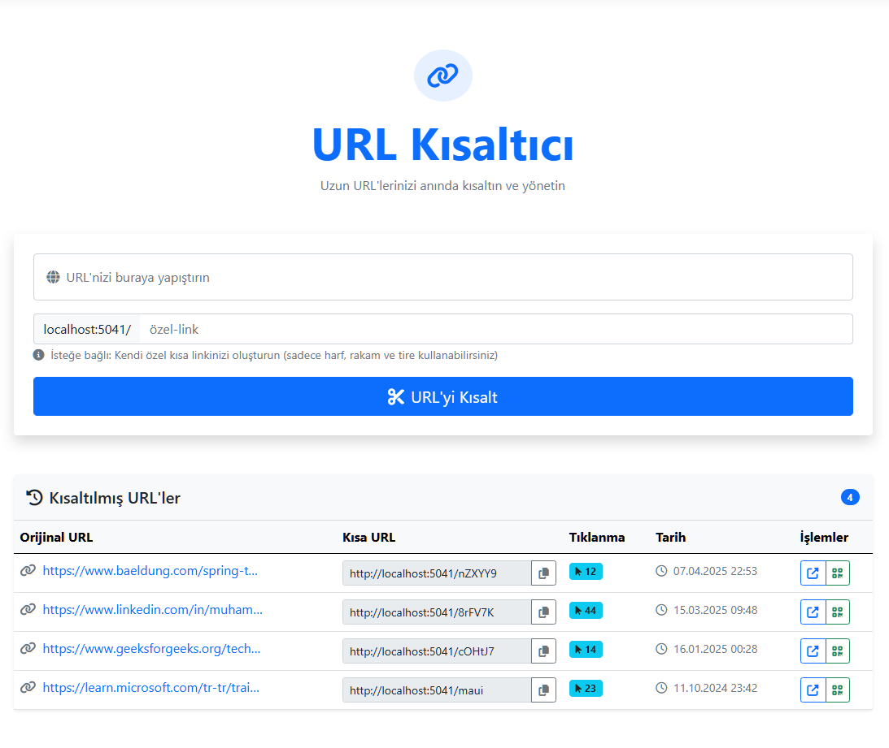

# URL Shortener

Kullanıcı dostu bir URL kısaltma projesidir. Bu uygulama ile uzun URL’leri hızlı bir şekilde kısaltabilir, isteğe bağlı olarak özel kısa linkler oluşturabilir ve her bağlantı için otomatik olarak QR kodları üretebilirsiniz. Paylaşımı kolaylaştıran, sade ve etkili bir çözüm sunar.




## Özellikler

- 🔗 URL Kısaltma
  - Otomatik kısa kod oluşturma
  - Özel kısa link tanımlama
  - URL doğrulama
  
- 📊 Link Yönetimi
  - Kısaltılan linklerin listesi
  - Tıklanma sayısı takibi
  - Oluşturulma tarihi bilgisi
  
- 📱 QR Kod
  - Her kısa link için QR kod oluşturma
  - QR kodları indirme imkanı
  
- 🎨 Kullanıcı Arayüzü
  - Responsive tasarım
  - Kolay kullanılabilir arayüz
  - Anlık bildirimler
  - Tek tıkla link kopyalama

## Teknolojiler

- ASP.NET Core 7.0
- Entity Framework Core
- SQLite
- Bootstrap 5
- Font Awesome
- SweetAlert2
- Clipboard.js
- QRCoder

## Kurulum

1. Projeyi klonlayın:
```bash
git clone https://github.com/kayamuhammet/UrlShortener.git
```

2. Proje dizinine gidin:
```bash
cd UrlShortener
```

3. Gerekli NuGet paketlerini yükleyin:
```bash
dotnet restore
```

4. Veritabanını oluşturun:
```bash
dotnet ef database update
```

5. Uygulamayı çalıştırın:
```bash
dotnet run
```

## Kullanım

1. Ana sayfada URL kısaltma formunu kullanarak uzun URL'nizi girin
2. İsteğe bağlı olarak özel bir kısa link belirleyin
3. "URL'yi Kısalt" butonuna tıklayın
4. Kısaltılan URL'yi kopyalayın veya QR kodunu indirin
5. Kısaltılan tüm URL'lerinizi ana sayfadaki listede görüntüleyin

## Katkıda Bulunma

1. Bu repository'yi fork edin
2. Feature branch'i oluşturun (`git checkout -b feature/new-feature`)
3. Değişikliklerinizi commit edin (`git commit -m 'Add some new feature'`)
4. Branch'inize push edin (`git push origin feature/new-feature`)
5. Pull Request oluşturun

## Lisans

Bu proje MIT lisansı altında lisanslanmıştır. Daha fazla bilgi için `LICENSE` dosyasına bakın.

## İletişim

Proje sorumlusu: Muhammet KAYA

GitHub: https://github.com/kayamuhammet

---

